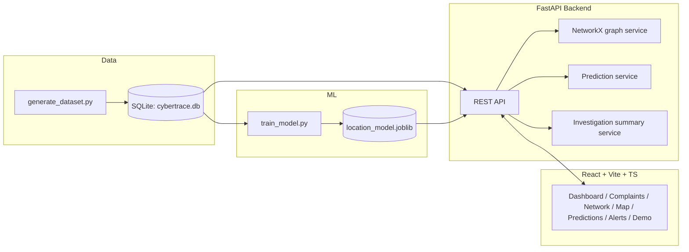

# CyberTrace AI
### Predictive Cybercrime & Cash Withdrawal Intelligence Platform

> ⚠️ **Decision-support prototype.** CyberTrace AI is designed to help authorized
> investigators prioritize where to look next. Predictions are **probabilistic
> forecasts**, not proof of criminal activity, and must be independently
> verified. The entire project runs on **synthetic, generated data** — no real
> people, accounts, or transactions are used anywhere.

---

## 1. Project Overview

CyberTrace AI converts fragmented cybercrime complaint and transaction data into
a single pipeline:

```
Complaint → Transaction Analysis → Fraud Risk → Money Flow →
Behavioral Analysis → Geographic Intelligence → Predicted Withdrawal
Locations → Investigator Action
```

It was built for the hackathon problem statement *"Predictive Analytics
Framework for Cybercrime Complaints to Forecast Likely Cash Withdrawal
Locations."*

## 2. Problem Statement

When a cybercrime victim's money is moved through a chain of mule accounts, the
final step is almost always a cash-out at an ATM, bank counter, or agent point.
Investigators need to know **where that cash-out is likely to happen** early
enough to intervene — but with thousands of complaints and millions of
transactions, doing this by hand doesn't scale.

## 3. Proposed Solution

A trained supervised ML model learns patterns from historical
complaint/transaction/withdrawal data (transaction velocity, account
connectivity, geographic movement, historical location frequency, etc.) and
predicts the **top-5 most likely withdrawal locations** for a new suspicious
complaint, with a calibrated probability, a composite risk score, and a
human-readable explanation for every prediction.

## 4. Key Features

- **Real ML pipeline** — RandomForest / GradientBoosting / XGBoost trained and
  compared on a genuine train/val/test split; the best model is selected
  automatically. Metrics are computed from real held-out data, never hardcoded.
- **Explainable predictions** — every prediction ships with feature-importance-derived,
  human-readable reasons ("Why this prediction?").
- **Transaction network graph** — built with NetworkX; traces money flow from
  victim → mule accounts → predicted cash-out point, with a "Trace Money Flow"
  action.
- **Interactive map** — Leaflet/OpenStreetMap view of all synthetic ATM/withdrawal
  locations, color-coded by risk.
- **Unified risk scoring** — 0–100 composite score broken into transaction,
  network, behavioral, location, and velocity risk components.
- **Investigation workspace** — auto-generated investigation summaries combining
  complaint, network, and prediction data.
- **One-click Live Demo** — runs the full pipeline end-to-end in ~15–30 seconds
  for presentations.
- **Data Explorer** — searchable/exportable tables for complaints, accounts,
  transactions, and locations.

## 5. Architecture



See `docs/architecture.md` for the detailed component diagram.

## 6. Tech Stack

| Layer     | Technology |
|-----------|------------|
| Frontend  | React, Vite, TypeScript, Tailwind CSS v4, Recharts, Leaflet/React-Leaflet, Lucide React |
| Backend   | Python, FastAPI, Pydantic, Uvicorn |
| ML        | scikit-learn, XGBoost, NetworkX, joblib, pandas, numpy |
| Database  | SQLite (designed to migrate cleanly to PostgreSQL — see below) |

## 7. ML Pipeline

1. `ml/generate_dataset.py` generates realistic **patterned** synthetic data:
   500 accounts (20% flagged as "mule" accounts with embedded suspicious
   behavior — higher connectivity, more devices, faster velocity), 100
   locations (15% "hotspots" that recur in fraud chains), 1,000 complaints,
   ~10,000 transactions (fraud chains + background noise), 300 withdrawals,
   and a labeled ML training table (~800 rows after filtering rare classes).
2. `ml/train_model.py`:
   - Engineers the features listed in the problem statement (velocity, amount
     anomaly, withdrawal frequency, time-of-day/day-of-week, distance
     traveled, historical location frequency, account connectivity, device
     count, etc.)
   - Splits data 60/20/20 into train/validation/test (**stratified**, so
     every location class appears in every split).
   - Trains RandomForest, GradientBoosting, and XGBoost; selects the best on
     validation accuracy; refits on train+validation; evaluates on the
     untouched test set.
   - Saves the model, encoders, and a `metrics.json` with **real** computed
     metrics (never hardcoded).

Latest run on the generated dataset (yours will vary slightly by run/seed):

| Metric | Value |
|---|---|
| Selected model | RandomForest |
| Top-3 location accuracy | ~95.6% |
| Top-5 location accuracy | ~98.1% |
| Precision (weighted) | ~78.9% |
| Recall (weighted) | ~77.0% |
| F1 (weighted) | ~77.0% |

An earlier version of the generator produced 100% accuracy across the board —
that was a red flag for label leakage (each mule account mapped deterministically
to exactly one location). The generator was fixed to inject realistic
uncertainty (an account's "preferred" cash-out point is only used ~72% of the
time) and per-row measurement noise on account-level features, which is why the
metrics above look like a real, learnable-but-imperfect task rather than a
memorization exercise.

## 8. Dataset

All CSVs are generated into `backend/data/`:

| File | Rows | Notes |
|---|---|---|
| `locations.csv` | 100 | 15% marked `is_hotspot` |
| `accounts.csv` | 500 | 20% marked `is_mule` |
| `complaints.csv` | 1,000 | risk-labeled |
| `transactions.csv` | ~10,000 | fraud chains + background noise |
| `withdrawals.csv` | 300 | |
| `ml_training_data.csv` | ~800 (post-filter) | model training table |

## 9. API Documentation

See `docs/API.md` for the full endpoint reference. Interactive Swagger docs are
also available at `http://localhost:8000/docs` once the backend is running.

## 10. Installation

**Prerequisites:** Python 3.10+, Node.js 18+

```bash
# 1. Clone/unzip the project, then from the repo root:

# --- ML: generate data & train the model ---
cd ml
pip install -r ../backend/requirements.txt
python generate_dataset.py
python train_model.py

# --- Backend: build the DB and start the API ---
cd ../backend
pip install -r requirements.txt
python app/database/setup_db.py
uvicorn app.main:app --reload --port 8000

# --- Frontend (in a new terminal) ---
cd ../frontend
npm install
npm run dev
```

Frontend dev server runs on `http://localhost:5173` and proxies `/api/*` to the
backend on `http://localhost:8000`.

## 11. Running Locally (quick reference)

| Step | Command |
|---|---|
| Generate data | `python ml/generate_dataset.py` |
| Train model | `python ml/train_model.py` |
| Build DB | `python backend/app/database/setup_db.py` |
| Start backend | `uvicorn app.main:app --reload --port 8000` (from `backend/`) |
| Start frontend | `npm run dev` (from `frontend/`) |

## 12. Demo Instructions

1. Open the app, click **"Explore Live Demo"** on the landing page (or
   **"RUN LIVE DEMO"** on the dashboard).
2. The system loads a high-risk sample complaint, animates through the
   transaction chain, builds the network graph, runs the real prediction
   model, and generates an investigation summary — all from one backend call
   (`POST /api/demo/run`), animated client-side over ~6 seconds.
3. Follow the "View full network graph" / "View all 5 predictions" links to
   drill into the Network Graph and Predictions pages for the same complaint.

See `docs/demo-script.md` for a full presentation script.

## 13. Model Evaluation

Real, test-set-computed metrics are shown live in the **Analytics** page of the
app (`/analytics`), and are always available via `GET /api/model/metrics`.

## 14. Future Scope

- Real-time financial intelligence feeds and banking fraud system integrations
- Government cybercrime complaint system integration
- Graph Neural Networks / Temporal Graph Networks for the network module
- Real-time streaming ingestion
- Advanced geospatial analytics, multi-city intelligence
- Federated learning across banks/agencies
- Human-in-the-loop investigation feedback to retrain the model

None of the above integrations exist in this prototype — they're documented
here as roadmap only.

## 15. Ethical Considerations

- Uses **only synthetic/anonymized data**; no real person's financial
  information appears anywhere in the code, data, or UI.
- Every prediction is explicitly labeled as a **probabilistic forecast**, never
  a certainty, and carries a disclaimer in both the API response and UI.
- The system is built as a **decision-support and prioritization tool** — it
  never automates legal or enforcement decisions.
- Error handling never leaks raw stack traces to the client.

## Known Limitations (be upfront about these)

This is a hackathon-scope build. A few things are intentionally simplified and
would need hardening for real deployment:
- SHAP is not wired in; explanations are feature-importance-based summaries.
- The frontend covers the full navigation and all core workflows, but some of
  the more exhaustive filter/sort permutations described in the original spec
  (e.g. every possible map filter combination) are simplified to the most
  useful subset.
- SQLite is used for demo simplicity; see the schema for a straightforward
  PostgreSQL migration path (swap the connection layer in
  `backend/app/database/db.py`).
