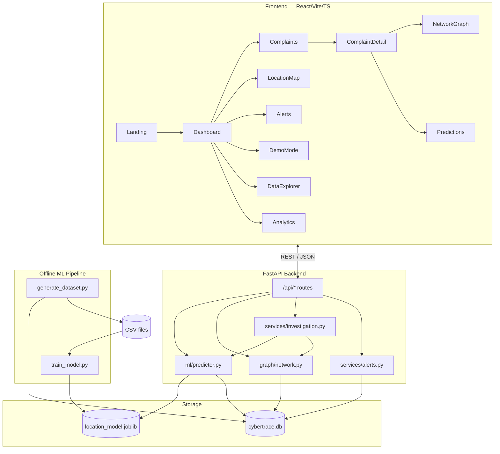

# Architecture

## Component Diagram

## Data Flow for a Prediction Request

1. Frontend calls `POST /api/predict` with a `complaint_id`.
2. `predictor.py` loads the complaint + suspected account from SQLite.
3. It reconstructs the same feature vector used at training time (transaction
   velocity, withdrawal frequency, account age, device count, distance from
   previous location, etc.) from live-looking DB data.
4. The trained RandomForest model runs `predict_proba` over all learned
   location classes.
5. Top-5 locations are ranked by probability, enriched with lat/lon and a
   composite risk score, and an explanation is derived from the model's
   feature importances.
6. The prediction is persisted to the `predictions` table and returned to the
   frontend with a disclaimer.

## Why SQLite (and how to move to PostgreSQL)

SQLite was chosen for zero-setup hackathon deployment. The data-access layer
(`backend/app/database/db.py`) is a thin `sqlite3` wrapper returning
`list[dict]`. To migrate:

1. Swap `sqlite3.connect` for a PostgreSQL driver (e.g. `psycopg[binary]`) or
   an ORM (SQLAlchemy).
2. Keep `query_df()`'s signature (`sql, params -> list[dict]`) so no calling
   code in `routes.py`, `predictor.py`, `network.py`, etc. needs to change.
3. Re-run `generate_dataset.py` output through a bulk loader (e.g.
   `COPY FROM` or SQLAlchemy `to_sql`) instead of `pandas.to_sql` on SQLite.

## Network Graph Construction

`graph/network.py` builds a directed `networkx.DiGraph` per complaint:
- Nodes = accounts (victim, suspected, intermediate), typed and risk-scored.
- Edges = transactions, carrying amount/channel/timestamp/risk.
- Node "importance" = degree centrality, used for node sizing in the UI.
- "Trace Money Flow" highlights the shortest path from victim to the
  suspected account.

## Explainability Approach

Rather than a black box, `predictor.py` surfaces the trained model's
`feature_importances_`, maps the top contributing features to human-readable
sentences (e.g. "High historical withdrawal frequency for this account"), and
returns them alongside every prediction. This is a lightweight,
dependency-free alternative to SHAP that still gives investigators a concrete
reason for each ranked location.
